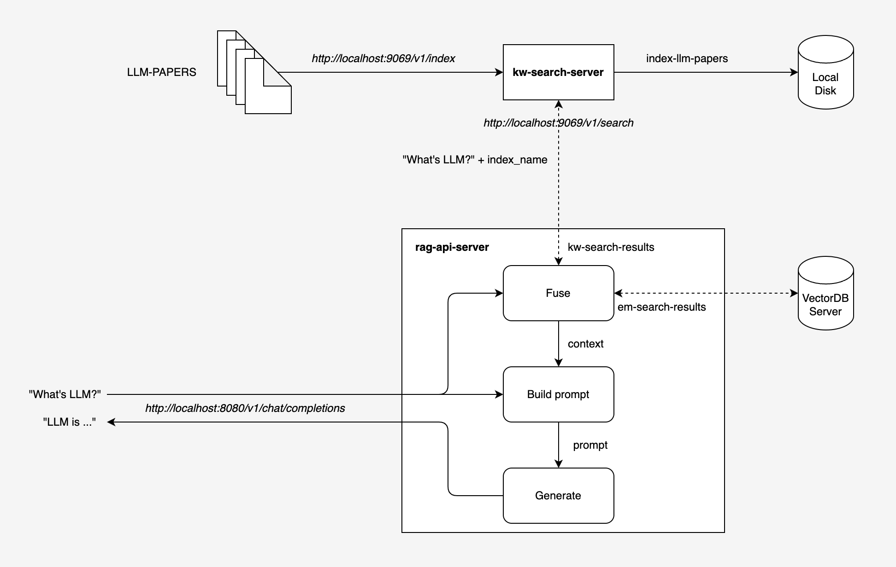

# Integration with Keyword Search

Since `LlamaEdge-RAG v0.13.0`, the keyword search feature is supported. This feature is powered by [kw-search-server](https://github.com/LlamaEdge/kw-search-server), which is a standalone server that provides keyword search services.

The following diagram shows the interactions between `rag-api-server` and `kw-search-server` while performing a chat completion.

<div align=center>

</div>

## Usage

### Enable keyword search

Assume that a keyword search server is running on `http://localhost:9069`. There are two ways to enable keyword search in `rag-api-server`:

- Set the `--kw-search-url` CLI option of `rag-api-server` while starting the rag-api-server.

- Set the `kw_search_url` field of the chat completion request(see [Perform chat completion with keyword search](#perform-chat-completion-with-keyword-search)) or rag creation request (see [Create collection and index from a document](#create-collection-and-index-from-a-document)) to the rag-api-server.

### Create collection and index from a document

The process of creating indexes for the target document is integrated into the creation of RAG. In other words, when creating RAG collections through the `/v1/create/rag` endpoint of the rag-api-server, indexes for the target document are created simultaneously.

Assume that the keyword search server is running on `http://localhost:9069`.

- If the rag-api-server is running on `http://localhost:8080` and using `--kw-search-url http://localhost:9069` to specify the keyword search server, you can create a RAG collection with the following command:

  ```bash
  curl --location 'http://localhost:8080/v1/create/rag' \
  --header 'Content-Type: multipart/form-data' \
  --form 'file=@"/Users/sam/workspace/demo/paris.txt"' \
  --form 'vdb_server_url="your_vdb_server_url"' \
  --form 'vdb_collection_name="your_vdb_collection_name"' \
  --form 'vdb_api_key="your_vdb_api_key"' \
  ```

- If the rag-api-server is running on `http://localhost:8080` without specifying the keyword search server, you can create a RAG collection with the following command:

  ```bash
  curl --location 'http://localhost:8080/v1/create/rag' \
  --header 'Content-Type: multipart/form-data' \
  --form 'file=@"/Users/sam/workspace/demo/paris.txt"' \
  --form 'vdb_server_url="your_vdb_server_url"' \
  --form 'vdb_collection_name="your_vdb_collection_name"' \
  --form 'vdb_api_key="your_vdb_api_key"' \
  --form 'kw_search_url="http://localhost:9069"'
  ```

If the curl request above is handled successfully, the following response body will be returned as shown below. The body contains two parts: `index` for the keyword search index and `embeddings` for the embeddings.

```json
{
    "index": {
        "results": [
            {
                "filename": "Unknown",
                "status": "indexed",
                "error": null
            },
            ...,
            {
                "filename": "Unknown",
                "status": "indexed",
                "error": null
            }
        ],
        "index_name": "index-2c70ccde-916e-45b1-99ef-97ac893fd438",
        "download_url": "http://localhost:9069/v1/index/download/index-2c70ccde-916e-45b1-99ef-97ac893fd438"
    },
    "embeddings": {
        "object": "list",
        "data": [
            {
                "index": 0,
                "object": "embedding",
                "embedding": []
            },
            ...,
            {
                "index": 326,
                "object": "embedding",
                "embedding": []
            }
        ],
        "model": "Nomic-embed-text-v1.5",
        "usage": {
            "prompt_tokens": 20355,
            "completion_tokens": 0,
            "total_tokens": 20355
        }
    }
}
```

### Perform chat completion with keyword search

The keyword search feature is integrated into the chat completion process. When performing a chat completion, the rag-api-server will first perform a keyword search and embedding search for the user query, then fuse the search results into the context, and finally build prompt with the user query and the context and feed it to the model to generate a chat completion.

Assume that the keyword search server is running on `http://localhost:9069`.

- If the rag-api-server is running on `http://localhost:8080` and using `--kw-search-url http://localhost:9069` to specify the keyword search server, you can create a RAG collection with the following command:

```bash
curl --location 'http://localhost:10086/v1/chat/completions' \
--header 'Content-Type: application/json' \
--data '{
    "messages": [
        {
            "role": "system",
            "content": "You are a helpful assistant. Answer questions as concisely as possible."
        },
        {
            "role": "user",
            "content": "What is the location of Paris, France along the Seine river?"
        }
    ],

    "vdb_server_url": "your_vdb_server_url",
    "vdb_collection_name": ["your_vdb_collection_name"],
    "limit": [5],
    "score_threshold": [0.5],
    "vdb_api_key": "your_vdb_api_key",
    "kw_index_name": "index-2c70ccde-916e-45b1-99ef-97ac893fd438",
    "kw_top_k": 5,
    "model": "Llama-3.2-3B-Instruct",
    "stream": false
}'
```

- If the rag-api-server is running on `http://localhost:8080` without specifying the keyword search server, you can create a RAG collection with the following command:

```bash
curl --location 'http://localhost:10086/v1/chat/completions' \
--header 'Content-Type: application/json' \
--data '{
    "messages": [
        {
            "role": "system",
            "content": "You are a helpful assistant. Answer questions as concisely as possible."
        },
        {
            "role": "user",
            "content": "What is the location of Paris, France along the Seine river?"
        }
    ],

    "vdb_server_url": "your_vdb_server_url",
    "vdb_collection_name": ["your_vdb_collection_name"],
    "limit": [5],
    "score_threshold": [0.5],
    "vdb_api_key": "your_vdb_api_key",
    "kw_search_url": "http://localhost:9069",
    "kw_index_name": "index-2c70ccde-916e-45b1-99ef-97ac893fd438",
    "kw_top_k": 5,
    "model": "Llama-3.2-3B-Instruct",
    "stream": false
}'
```

If the curl request above is handled successfully, the following response body will be returned as shown below:

```json
{
    "id": "chatcmpl-72d9b542-4ee6-4a38-b9f6-75677765eef3",
    "object": "chat.completion",
    "created": 1737531879,
    "model": "Llama-3.2-3B-Instruct",
    "choices": [
        {
            "index": 0,
            "message": {
                "content": "Paris, France is located on the banks of the Seine River, with two islands, Île Saint-Louis and Île de la Cité, within the city.",
                "role": "assistant"
            },
            "finish_reason": "stop",
            "logprobs": null
        }
    ],
    "usage": {
        "prompt_tokens": 209,
        "completion_tokens": 37,
        "total_tokens": 246
    }
}
```
